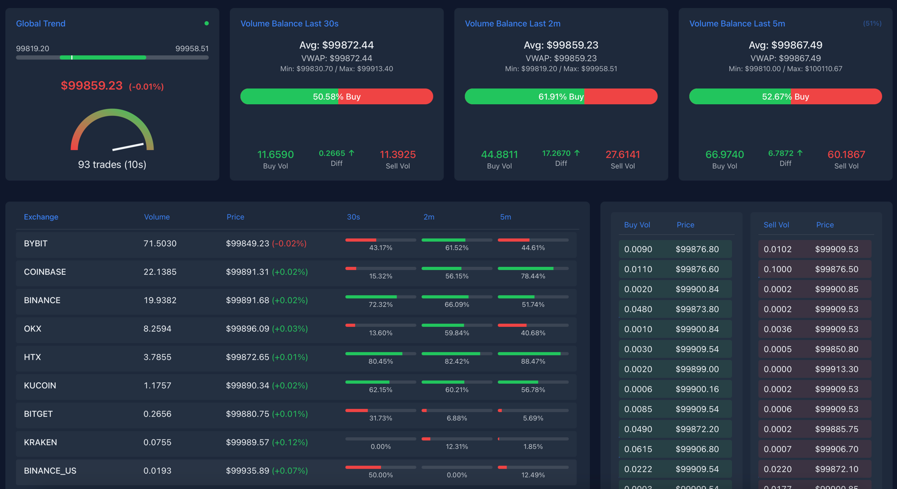

# Coiny Bubble - Main Dashboard

This is the main dashboard for **Coiny Bubble**, showing real-time aggregated BTC (or other tokens) trades, volumes, and prices across multiple exchanges. It uses a WebSocket to receive aggregated snapshots.

**Features:**

- **Global Trend**:
  - A white slider (2-minute price range).
  - A 10s color segment (green if buy volume >= sell volume, red otherwise).
  - A white marker showing the current price.
  - A speedometer indicating the number of trades in the last 10 seconds.
- **Volume Balance**:
  - 30s, 2m, 5m blocks showing average prices, VWAP, min/max prices, buy/sell volumes, and differences.
- **Exchanges**:
  - Sorted by total volume (5m).
  - Individual exchange buy% bars for 30s, 2m, 5m.
- **Trades**:
  - Left column: recent buy trades.
  - Right column: recent sell trades.
  - Dynamic background color intensity based on volume size.

