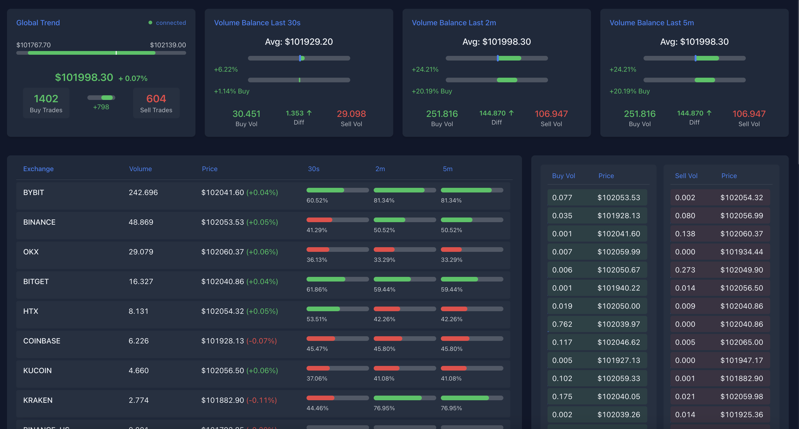

# Real-Time Crypto Trading Dashboard

A responsive, real-time cryptocurrency trading dashboard built with Vue.js that visualizes live trading data through WebSocket connections. The dashboard provides comprehensive market insights including price trends, volume analysis, and exchange-specific metrics.



## 🚀 Features

- Real-time price and volume tracking across multiple timeframes (10s, 30s, 2m, 5m)
- Live buy/sell trade monitoring with volume visualization
- Exchange-specific analytics and performance metrics
- Responsive design that works on desktop and mobile devices
- Automatic fallback to mock data if WebSocket connection fails
- Visual indicators for connection status and data staleness

## 🔧 Technical Stack

- Vue.js 3 (Composition API)
- Native WebSocket API
- Pure CSS for styling (no external UI libraries)
- Vanilla JavaScript for data processing

## 📊 Dashboard Components

### Global Trend
- Displays current market trend with a price range slider
- Shows 10-second buy/sell trade counts
- Visual indicator for price movement direction
- Real-time connection status monitoring

### Volume Balance Blocks (30s, 2m, 5m)
- Average price calculations
- Buy/sell volume comparisons
- Price trend visualization
- Volume difference metrics
- Percentage-based buy/sell ratio indicators

### Exchange Overview
- Per-exchange volume tracking
- Price comparisons across exchanges
- Timeframe-specific buy/sell ratios
- Volume-based sorting

### Recent Trades
- Separate buy/sell trade columns
- Volume-based visual scaling
- Price tracking for individual trades
- Limited to most recent 50 trades per side

## 🔌 WebSocket Implementation

The application uses a dedicated `WebSocketService` class that handles all real-time data communications:

```javascript
const ws = new WebSocketService({
  url: 'wss://btc.coinybubble.com/ws/btc',
  debug: true,
  onMessage: (msg) => {
    // Message handling logic
  },
  onConnected: () => {
    // Connection established
  }
});
```

### Key WebSocket Features:

1. **Automatic Reconnection**
   - Implements exponential backoff strategy
   - Maximum of 5 reconnection attempts
   - Configurable timeout intervals

2. **Data Validation**
   - Strict message format checking
   - Timestamp validation
   - Volume and price sanity checks

3. **Mock Data Fallback**
   - Automatic switching to mock data on connection failure
   - Realistic data simulation
   - Seamless user experience maintenance

4. **Error Handling**
   - Comprehensive error reporting
   - Connection state management
   - Data staleness detection

### WebSocket Message Format

```javascript
{
  exchange: "exchange_name",
  timestamp: 1642342342342,
  buy_volume: 1.23,
  sell_volume: 0.45,
  buy_avg_price: 45123.45,
  sell_avg_price: 45120.32,
  buy_count: 3,
  sell_count: 1
}
```

## 🎨 Styling

The dashboard uses a custom CSS implementation with:
- Dark theme optimized for trading
- Responsive grid layout
- Smooth animations and transitions
- Custom scrollbar styling
- Flexible card-based component design

## 🚦 Getting Started

### Project Structure
```
main-dashboard/
├── Dockerfile
├── img.png
├── index.html
└── src/
    ├── css/
    │   └── main.css
    └── js/
        ├── main.js
        └── services/
            └── websocket.js
```

### Local Development

1. Clone the repository:
```bash
git clone https://github.com/coinybubble/main-dashboard.git
```

2. Open the project:
- Simply open `index.html` in your web browser
- Alternatively, you can use any local development server

### Docker Deployment

1. Build the Docker image:
```bash
docker build -t main-dashboard .
```

2. Run the container:
```bash
docker run -d -p 80:80 main-dashboard
```

3. Access the dashboard at `http://localhost`

## 💻 Development

### Configuration

The application uses several constants that can be configured in `main.js`:

```javascript
const CONSTANTS = {
  THIRTY_SECONDS: 30000,
  TWO_MINUTES: 120000,
  FIVE_MINUTES: 300000,
  TEN_SECONDS: 10000,
  MAX_SNAPSHOTS: 1000
};
```

## 📝 License

MIT License - feel free to use this project for any purpose.

## 🤝 Contributing

Contributions are welcome! Please feel free to submit a Pull Request.

## 🐛 Bug Reports

If you find a bug, please create an issue with:
1. Steps to reproduce
2. Expected behavior
3. Actual behavior
4. Screenshots (if applicable)

## 📮 Contact

If you have any questions or feedback, please create an issue or contact the maintainer.

---

Made with ❤️ by CoinyBubble
